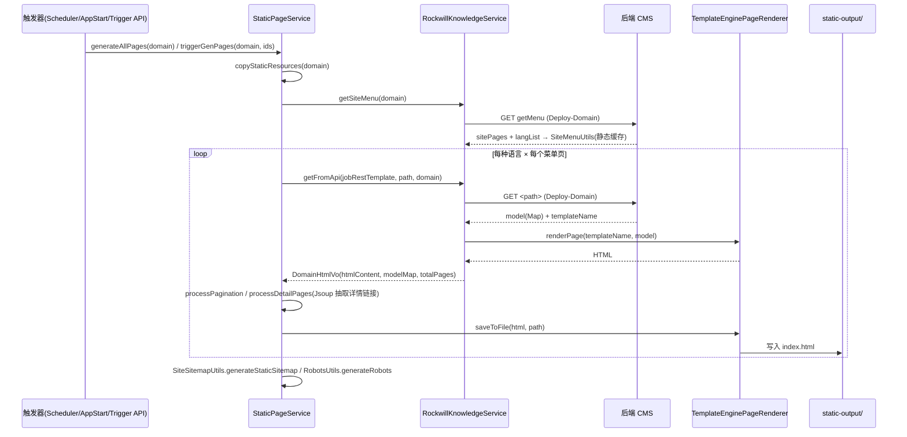
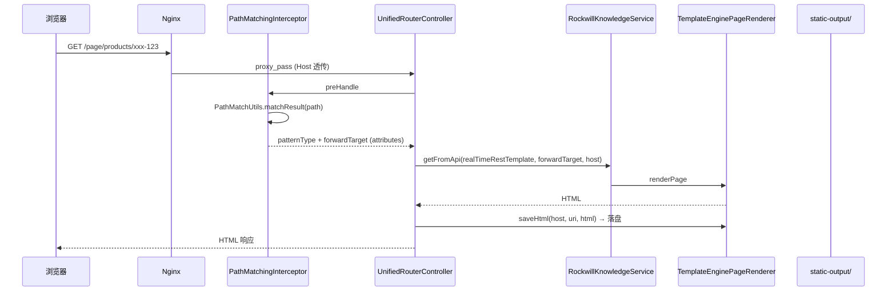

# 01 · 系统架构

本文档说明 `wone-standalone-site` 的整体架构、两条核心数据流与部署拓扑。

---

## 1. 角色定位

| 角色 | 说明 |
| --- | --- |
| 内容源 | 后端 CMS（`wcm-api`，`application.yml` 中 `wcm-api: http://192.168.35.16/wcm-api/site/static/`），提供菜单、详情、搜索等渲染后数据 |
| 渲染/落盘 | 本服务：拉取 CMS 数据 → Thymeleaf 渲染 → 写入 `static-output/`，并维护 sitemap/robots |
| 静态服务 | Nginx：直接托管 `static-output/`；找不到时回源到本服务 `/page/**` 实时渲染 |
| CDN | Cloudflare：缓存静态资源；内容变更时由 `CloudflarePurgeService` 按 URL 清理 |

---

## 2. 配置与常量一览

- 应用端口：`server.port=9080`（Spring Boot）
- 静态输出根：`brand.static-output=./static-output`（Nginx 的 `root` 也指向此目录）
- 主域名：`brand.domain=www.test-static.com`
- 多站点：`brand.domain-list`（可为空）
- 语言：`brand.languages`（60+ 语言代码）、`brand.mapLang`（含地区后缀，如 `en_US`）
- 定时：`brand.cron="0 0 6 */3 * ?"`（每 3 天 06:00）、`brand.scheduler-enable=true`、`brand.execute-on-start=true`
- CDN：`cdn.enabled=true`，`cdn.prefix=https://oss.iee-business.com`，`cdn.version=1.1.5`
- 安全：`brand.secret`（签名密钥，MD5 签名校验用）

---

## 3. 数据流 A：批量/增量静态化（离线生成）

发生在应用启动后或定时/手动触发，目标是把整站（或指定实体）渲染成静态文件。



要点：
- `generateAllPages` 先生成首页与默认语言，再遍历 `SiteMenuUtils.getLangList()` 生成各语言版本（`StaticPageService.java:140`）。
- 详情页链接通过 **Jsoup** 解析列表页 HTML 的指定 CSS 选择器抽取（产品/新闻/方案/Blog/成功案例各有不同选择器，见 `processDetailPages`）。
- 产品类额外处理「系列页（`-series`）」与 `detail` 详情目录。
- 所有生成异步化：列表/详情任务提交到 `rockwillTaskExecutor` 线程池，`CompletableFuture.allOf(...).join()` 收口。

---

## 4. 数据流 B：实时回源渲染（在线兜底）



要点：
- `PathMatchingInterceptor` 在 `preHandle` 做正则 URL 匹配，把 Nginx 传来的 `/page/...` 内部路径映射成 CMS 的 `forwardTarget`（如 `/public/detail?name=...&id=...`），非法路径重定向首页。
- 非 `/search` 且非 404 的页面，渲染后**立即落盘**，下次请求即由 Nginx 直出（增量自愈）。
- `realTimeRestTemplate` 超时 10s（与批量任务的 `jobRestTemplate` 120s 区分）。

---

## 5. 数据流 C：内容同步与 CDN 清理

CMS 编辑内容后调用 `POST /api/staticize/sync`（带签名）：

1. `ApiSignatureInterceptor` 校验 MD5 签名 + 5 分钟时效（**sync 接口豁免频率限制**）。
2. `StaticizeTriggerController.triggerSync` 解析 `StandaloneSyncEvent`（实体类型 + 操作 + 实体 ID + 部署域名）。
3. `DELETE` 动作直接忽略（软删除由 CMS 侧处理），`CREATE/UPDATE` 进入清理：
   - 删首页 `index.html` 并重新生成；
   - 删该栏目的分页目录（`pageName-*`）；
   - 删主页面及详情目录（按 `-entityId` 匹配；产品类额外匹配 `-series` 与 `detail/` 子目录）；
4. 收集到的 URL 交给 `CloudflarePurgeService.purgeByUrls` 分批清理（默认每批 100，批间间隔 1200ms）。

---

## 6. 部署拓扑

```mermaid
flowchart LR
    U["用户/爬虫"] --> NX["Nginx :80\nroot=static-output/"]
    NX -->|静态命中| FS[("static-output/\n(域名子目录)")]
    NX -->|@api_backend\n未命中| APP["Spring Boot :9080"]
    APP -->|写| FS
    APP -->|读/渲染| CMS["CMS API\n192.168.35.16"]
    APP -->|purge_cache| CF["Cloudflare"]
    CF -.缓存.-> U
```

> ⚠️ **配置注意**：`nginx/server.conf` 的 `proxy_pass` 指向 `http://localhost:8080`，但 `application.yml` 中 `server.port=9080`。生产环境通常由前置 LB/另一层代理补齐端口差异；本地联调时需注意端口一致（否则实时回源 502）。
