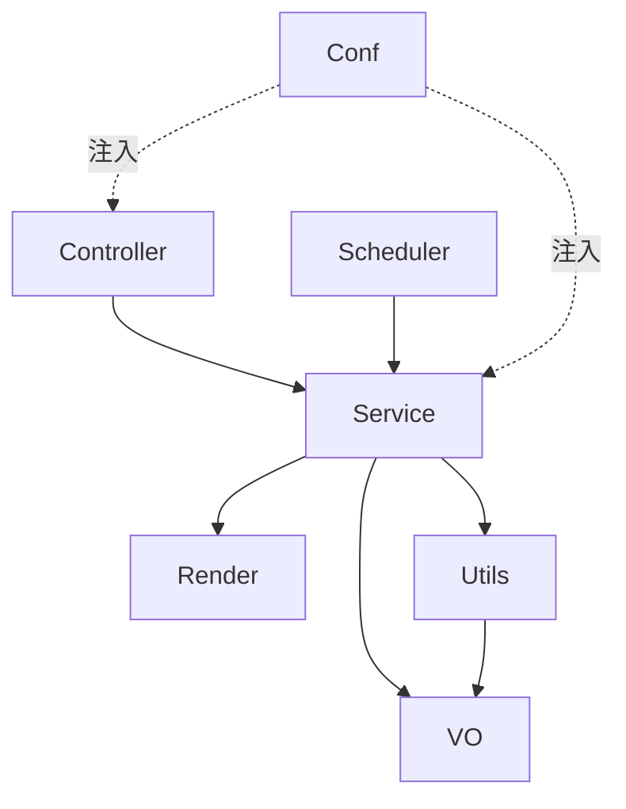

# 02 · 模块职责

按 `com.rockwill.deploy` 下的包划分，说明各模块的职责与边界。

---

## 包结构

```
com.rockwill.deploy
├── StandAloneSiteApplication      # 启动入口
├── conf/                          # 配置类、拦截器、属性绑定、过滤器
├── controller/                    # 对外 REST 入口（路由 + 静态化触发）
├── service/                       # 业务逻辑（CMS 客户端 / 静态化引擎 / CDN 清理）
├── render/                        # Thymeleaf 渲染与落盘
├── scheduler/                     # 定时任务
├── utils/                         # 工具类（URL 匹配 / 菜单缓存 / sitemap / robots 等）
└── vo/                            # 值对象 / DTO / 枚举
```

---

## 1. `controller` — 对外入口

| 类 | 职责 | 关键端点 |
| --- | --- | --- |
| `UnifiedRouterController` | **实时回源渲染**。处理所有 `/page/**`：从 `PathMatchingInterceptor` 取 `patternType`/`forwardTarget`，调 CMS 渲染后落盘并返回 HTML。 | `GET/POST /page/**` |
| `StaticizeTriggerController` | **静态化触发 + 同步清理**。手动全量/增量生成；处理 CMS 同步事件（删文件 + Cloudflare 清理）。 | `POST /api/staticize/trigger`<br>`POST /api/staticize/sync` |

边界：Controller 只做编排与参数解析，不写渲染/落盘细节（委托 `StaticPageService` / `CloudflarePurgeService`）。

---

## 2. `service` — 业务核心

| 类 | 职责 | 依赖 |
| --- | --- | --- |
| `StaticPageService` | **静态化引擎**。全量/增量生成、首页/菜单/详情/分页遍历、静态资源拷贝、sitemap/robots 触发、HTML 落盘。 | `RockwillKnowledgeService` `TemplateEnginePageRenderer` `SiteSitemapUtils` `BrandConfig` |
| `RockwillKnowledgeService` | **CMS 客户端 + 渲染编排**。调用 `wcm-api`（菜单/首页/详情/搜索/表单），注入 CDN/SEO/Schema/GA 等模型变量，调 Thymeleaf 渲染，处理 multipart 表单转发与请求日志。 | `TemplateEnginePageRenderer` `BrandConfig` `GoogleTagProperties` `RestTemplate` |
| `CloudflarePurgeService` | **CDN 缓存清理**。按域名解析 zoneId/token，分批 `purge_cache`，去重、批间间隔、单批失败不中断。 | `CloudflareProperties` `RestTemplate` |

边界：`StaticPageService` 负责「生成什么、写到哪」；`RockwillKnowledgeService` 负责「向 CMS 要数据并渲染成 HTML」；`CloudflarePurgeService` 独立负责 CDN 侧清理。

---

## 3. `render` — 渲染层

| 类 | 职责 |
| --- | --- |
| `TemplateEnginePageRenderer` | 用 `SpringTemplateEngine` 渲染指定模板；无 HTTP 上下文时回退 `MockHttpServletRequest`；把 `http://oss.iwone.cn` 替换为 `https://oss.iee-business.com`；`saveToFile` 落盘 UTF-8。 |

---

## 4. `scheduler` — 定时任务

| 类 | 职责 |
| --- | --- |
| `StaticPageScheduler` | `@Scheduled(cron="${brand.cron}")` 每日（每 3 天）触发 `generateAllPages`，先主域名、再 `domain-list` 各域名；受 `brand.scheduler-enable` 开关控制。 |

---

## 5. `conf` — 配置与拦截

| 类 | 职责 |
| --- | --- |
| `BrandConfig` | 绑定 `brand.*` 配置（域名、输出目录、语言、密钥、开关等） |
| `CloudflareProperties` | 绑定 `cloudflare.*`：默认 + 按域名覆盖的 zoneId/token、批量大小、批间间隔 |
| `GoogleTagProperties` | 绑定 `google-tag.*`：默认 GA ID + 按域名覆盖 |
| `WebConfig` | 注册两个拦截器、静态资源 Handler（`/static/**`、`/js/**` 缓存 180 天）、CORS、注册 `CachingRequestBodyFilter` |
| `PathMatchingInterceptor` | `/page/**` 前置：正则匹配 URL、校验菜单合法性、传递 `patternType`/`forwardTarget`/`X-Original-URI` |
| `ApiSignatureInterceptor` | `/api/staticize/**` 前置：MD5 签名校验、5 分钟时效、发布频率限制（1 次/小时、5 次/天，sync 豁免） |
| `RestTemplateConfig` | 定义 `realTimeRestTemplate`(超时10s) 与 `jobRestTemplate`(超时120s，@Primary)；都走 Apache HttpClient 连接池 + 跳过 SSL 校验 |
| `RestTemplateHeaderInterceptor` | 给出站请求补 `X-Original-URI` |
| `AsyncConfig` | 定义 `rockwillTaskExecutor` 线程池（核心=max(5,核数*5)，最大=max(25,核数*12)，队列 2000） |
| `ThymeleafConfig` | 构建 `SpringTemplateEngine`，启用 SpEL 编译，注册自定义方言 `MyUtilsDialect` |
| `ApplicationContextHolder` | 静态持有 `ApplicationContext`，供非 Spring 托管代码（如 `PathMatchUtils`）取 Bean |
| `AppStartListener` | `ApplicationReadyEvent`：启动时拷贝静态资源、预热菜单、按需执行全量生成 |
| `CachingRequestBodyFilter` | 包装请求体为 `ContentCachingRequestWrapper`，使 `ApiSignatureInterceptor` 可重复读取参数 |
| `RouteExceptionHandler` | 全局异常处理 |
| `MyUtilsDialect` | Thymeleaf 自定义方言（模板中可用工具方法） |

---

## 6. `utils` — 工具

| 类 | 职责 |
| --- | --- |
| `PathMatchUtils` | **URL 路由核心**。正则匹配 Nginx 风格 location，返回 `PathPatternType` + `forwardTarget` + 是否非法；处理语言前缀、菜单名校验 |
| `PathPatternType` | 路由类型枚举，每种类型对应 CMS 的 `forwardTarget`（如 `DETAIL→/public/detail`） |
| `SiteMenuUtils` | 静态缓存当前站点的 `menuPages` 与 `langList`（由 `getSiteMenu` 填充，进程内共享） |
| `SiteSitemapUtils` | 生成 `sitemap.xml`（>2000 URL 自动分块 + 索引），注入 XSL |
| `RobotsUtils` | 生成 `robots.txt`（含 AI 爬虫规则 + Sitemap 指向） |
| `ThymeleafUtils` | 字符串规范化（用于 URL slug 生成） |
| `AccessRecord` | 按 `appId` 记录访问时间戳，支持时间窗口计数（频率限制用） |

---

## 7. `vo` — 值对象

| 类 | 职责 |
| --- | --- |
| `SitePage` | 站点页面实体；内嵌 `SitePageType` 常量（HOME=1, PRODUCTS=2, SOLUTIONS=3, DOCUMENTS=4, NEWS=5, PROFILE=6, SUCCESS_REFERENCE=7, BLOG=8） |
| `DomainHtmlVo` | CMS 返回的渲染结果：`htmlContent` / `totalPages` / `modelMap` / `httpErrCode` |
| `AjaxResult<T>` | 后端通用响应包装（code/data/msg） |
| `SecurityReq` | 签名请求参数（appId/timestamp/nonce/signature/data） |
| `StandaloneSyncEvent` | CMS 同步事件（entityType/action/entityId/deployDomain…） |
| `StandaloneSyncEntityType` | 同步实体类型枚举，映射到 `SitePageType` |
| `StandaloneSyncAction` | CREATE / UPDATE / DELETE |

---

## 模块依赖总览（简化）


