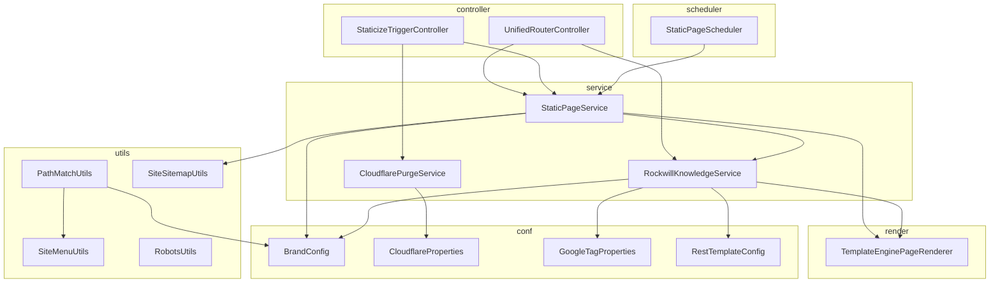

# 04 · 依赖关系

## 1. 第三方依赖（`pom.xml`）

| 依赖 | 版本 | 用途 |
| --- | --- | --- |
| `spring-boot-starter-web` | 2.6.13 (BOM) | Web MVC、Tomcat、内嵌容器 |
| `spring-boot-starter-thymeleaf` | 2.6.13 (BOM) | 模板引擎（SpringTemplateEngine、方言） |
| `spring-test` | BOM | 测试上下文 |
| `lombok` | optional | 注解简化（@Data/@Slf4j 等） |
| `jsoup` | **1.10.2** | 解析渲染后 HTML、抽取详情页链接 |
| `sitemapgen4j` (com.github.dfabulich) | **1.1.1** | 生成 sitemap.xml（支持分块/索引） |
| `httpclient` (org.apache.httpcomponents) | **4.5.14** | Apache HttpClient（连接池 + 跳过 SSL） |
| `fastjson2` (com.alibaba) | **2.0.43** | JSON 解析/序列化（CMS 响应、签名、Schema 改写） |
| `commons-lang3` (org.apache.commons) | BOM | 字符串/正则/校验工具 |
| `hutool-crypto` (cn.hutool) | **5.3.8** | 文件工具（落盘/清理）；注意仅用了 `FileUtil` |
| `junit` / `junit-jupiter` / `mockito-junit-jupiter` / `junit-vintage-engine` | test | 测试（当前基本未使用） |

> Spring Boot 版本统一由 `spring-boot-dependencies:2.6.13` 管理（BOM import）。
> Java 编译级别 **1.8**（`maven-compiler-plugin` source/target 1.8）。

---

## 2. 内部依赖（包间调用）

要点：
- `StaticPageService` 是唯一编排中心，依赖 `RockwillKnowledgeService`（取数+渲染）、`TemplateEnginePageRenderer`（落盘）、`SiteSitemapUtils`、`BrandConfig`。
- `RockwillKnowledgeService` 通过 `RestTemplate`（`RestTemplateConfig` 提供）访问 CMS，依赖 `BrandConfig`/`GoogleTagProperties` 注入模板变量。
- `PathMatchUtils` 经 `ApplicationContextHolder` 取 `BrandConfig` 加载支持语言，并依赖 `SiteMenuUtils` 校验菜单合法性。

---

## 3. 运行环境依赖

| 依赖 | 说明 |
| --- | --- |
| JDK | **Java 8**（`java.version=1.8`） |
| 后端 CMS | `wcm-api`（HTTP，内网 `192.168.35.16`）；应用必须能访问才能渲染 |
| Nginx | 静态托管 `static-output/`，未命中回源到应用 |
| Cloudflare | 仅当启用 CDN 清理时需要（zoneId/apiToken 按域名配置） |
| Maven | 构建（`mvn package` → 可执行 jar） |

---

## 4. 配置键 → 消费方映射

| 配置键 | 绑定类 | 消费方 |
| --- | --- | --- |
| `brand.*` | `BrandConfig` | 路由、生成、启动触发、拦截器 |
| `cloudflare.*` | `CloudflareProperties` | `CloudflarePurgeService` |
| `google-tag.*` | `GoogleTagProperties` | `RockwillKnowledgeService`（GA ID 注入） |
| `cdn.*` | 直接 `@Value` | `RockwillKnowledgeService`（CDN 前缀/版本） |
| `wcm-api` | 直接 `@Value` | `RockwillKnowledgeService` |
| `server.port` | Spring | 应用监听 9080 |
| `brand.cron` | SpEL | `StaticPageScheduler` |

---

## 5. 外部契约（与 CMS 的接口约定）

| CMS 接口 | 调用方 | 返回 |
| --- | --- | --- |
| `GET getMenu` | `getSiteMenu` | `AjaxResult{ sitePages[], langList[] }` |
| `GET <forwardTarget>?name=&id=&pageNum=&lang=` | `getFromApi` | `AjaxResult{ templateName, 模型Map, pageData.totalPages }` |
| `POST <targetUrl>`（leaveMessage/upload） | `forwardFormRequest` | 透传 |
| `POST /publish/updateState` | `submitForm` | 发布状态回写 |
| `GET publish/todayUpdatedIds` | `getTodayUpdatedIds` | 当日更新 ID 分组 |
