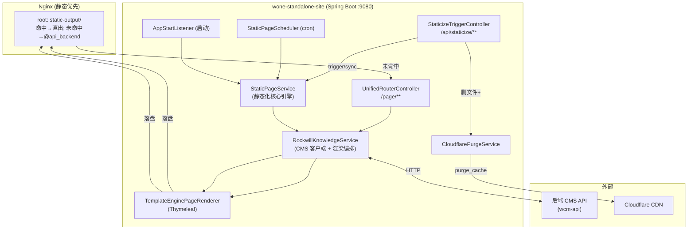

# wone-standalone-site · Code Wiki

> 基于源码逐文件阅读 + **CodeGraph** 符号级知识图谱（`codegraph explore` / `status` / `files`）生成的工程化代码文档。
> CodeGraph 索引位于 `.codegraph/`（本地 SQLite，202 文件 / 3,924 节点 / 34,579 边）。

本仓库是一个 **Spring Boot 2.6.13（Java 8）静态网站生成与部署服务**：从后端 CMS API 拉取内容，用 Thymeleaf 渲染成 HTML，落盘为静态文件，由 Nginx 对外提供服务；并对未静态化的页面做实时回源渲染。

---

## 1. 文档索引

| 文档 | 内容 |
| --- | --- |
| [01-系统架构](01-系统架构.md) | 整体架构、两条核心数据流、部署拓扑、时序图 |
| [02-模块职责](02-模块职责.md) | 按包划分的模块职责与边界 |
| [03-关键类与函数](03-关键类与函数.md) | 核心类、关键方法、调用关系（含 CodeGraph blast-radius） |
| [04-依赖关系](04-依赖关系.md) | 第三方依赖、内部依赖、运行环境依赖 |
| [05-运行部署与配置](05-运行部署与配置.md) | 构建、运行、配置项、Nginx、定时任务、安全签名 |

---

## 2. 一分钟速览

- **本质**：CMS 内容的「静态化渲染器 + 落盘器 + CDN 清理触发器」。本身不存业务数据，所有内容来自 `wcm-api`（后端 CMS）。
- **两个入口**
  - **批量/增量静态化**：定时任务（`StaticPageScheduler`，cron `0 0 6 */3 * ?`）、启动触发（`AppStartListener`）、手动触发（`POST /api/staticize/trigger`）→ `StaticPageService` 生成全站。
  - **实时回源**：Nginx 命中不到静态文件时 `proxy_pass` 到应用 `→ /page/**`（`UnifiedRouterController`）实时渲染并落盘。
- **同步与清理**：CMS 内容变更推 `POST /api/staticize/sync` → 删除受影响静态文件 + 调 Cloudflare 清理 CDN 缓存。
- **多域名 + 多语言**：支持品牌主域名及 `domain-list` 多站；`brand.languages` 配置 60+ 语言，每种语言生成独立静态目录。
- **输出目录**：`static-output/`（即 Nginx 的 `root`），按域名分子目录。

---

## 3. 顶层架构图

---

## 4. 关键统计（CodeGraph）

| 维度 | 数量 |
| --- | --- |
| 源码文件（Java） | 36 |
| 总节点 / 边 | 3,924 / 34,579 |
| 类 / 方法 / 函数 | 82 / 787 / 1,457 |
| 路由（route 节点） | 3 |
| 模板（resources/templates） | 27 |

> 注：模板与静态资源（js/css/img）亦被索引，但业务编排逻辑集中在 `com.rockwill.deploy` 下的 36 个 Java 文件。
